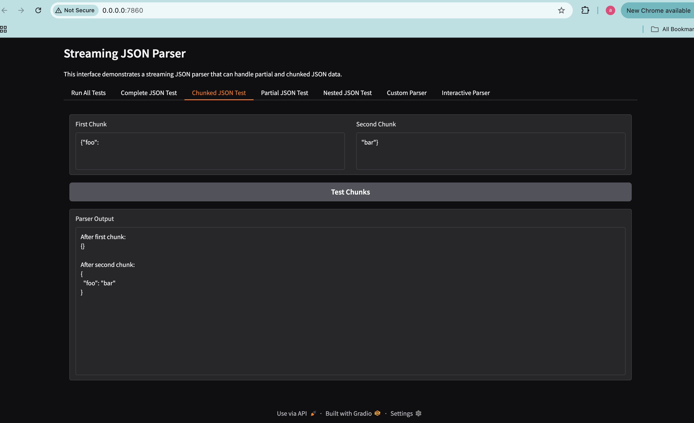

# Streaming JSON Parser

This is a streaming JSON parser designed specifically for Large Language Model (LLM). It processes JSON data incrementally, making it ideal for handling streaming responses from LLMs.

### Objective

The parser is built to handle a subset of JSON where:

Values consist only of strings and objects.

Escape sequences and duplicate keys are not expected.

Partial responses should be parsed incrementally, allowing partial string values to be returned.

A key-value pair is only returned once its value type is determined.

This ensures that even if the input JSON data is incomplete, the parser can return the current state of the parsed JSON object at any given point in time.

## Features

Handles complete and chunked JSON inputs

Supports nested JSON objects

Processes JSON incrementally, returning partial values where applicable

Provides an interactive interface for testing JSON parsing

## How It Looks

The app features a Gradio-based UI with multiple tabs:

Run All Tests: Runs a suite of tests to validate the parser.

Complete JSON Test: Tests a full JSON object.

Chunked JSON Test: Demonstrates parsing JSON in chunks.

Partial JSON Test: Shows how the parser handles incomplete JSON.

Nested JSON Test: Tests JSON objects with nested structures.

Custom Parser: Allows users to input JSON and set chunk sizes.

Interactive Parser: Lets users incrementally add chunks and see the parser's state.

## Usage

### Running Locally with Python

Ensure you have Python installed (3.13 recommended).

python3 -m venv parser
source parser/bin/activate
pip install -r requirements.txt
python main.py

This starts the Gradio interface, which you can access at http://localhost:7860.

### Running with Docker

Build and run the container:

docker build -t streaming-json-parser .
docker run -p 7860:7860 streaming-json-parser

### Running with Docker Compose

Use the provided docker-compose.yaml to start the container:

docker-compose up -d

This starts the service in detached mode, and you can access it at http://localhost:7860.

## Code Overview

main.py

The main logic consists of a StreamingJsonParser class that processes JSON in an incremental way. It:

Stores JSON chunks in a buffer.

Parses the buffer character by character.

Maintains an internal state using a stack to track nested structures.

Returns key-value pairs only when the value type is determined.

Allows partial string values to be returned as part of an incomplete JSON response.

Gradio is used to create a simple UI where users can test the parser interactively.

## Conclusion

This app demonstrates how to incrementally parse JSON data, making it ideal for streaming LLM responses or handling large JSON payloads efficiently.